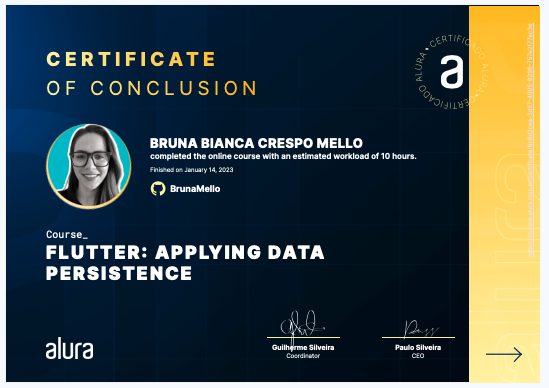

<h1>Flutter: Web API: Integrating your Application</h1>

Take this Flutter course and:

- Learn how to make a personal organization application that allows you to save, edit and delete user tasks
- Know and apply internal persistence, understanding its importance in a project
- Learn how to implement a database to save information on a mobile device
- Get to know and use SQFLite, one of the most used databases by the dev community
- Implement the four CRUD operations in one app: read, create, edit and delete data
- Practice important Flutter concepts and techniques such as the FutureBuilder widget
- Find out what packages are, their importance in mobile development and install one of them

## 🔨 Project: Simple Journal

Web API - Integrating your Application

Certificate: 'https://cursos.alura.com.br/certificate/6c6d2cea-3d57-4905-8296-757e2f77ec3e'

